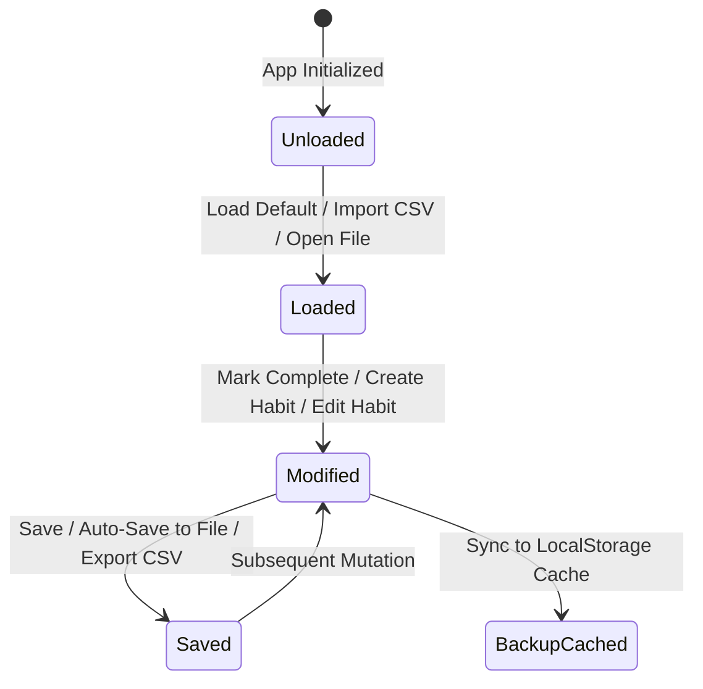

# Data Model: Habit and Streak Tracker

**Feature**: Habit and Streak Tracker  
**Branch**: `001-habit-streak-tracker`  
**Date**: 2026-09-28  

---

## 1. Core Entities

### 1.1 Habit
Represents a user-defined habit tracked by the system.

| Field | Type | Description | Constraints & Validation |
| --- | --- | --- | --- |
| `id` | `string` | Unique identifier (e.g., `h_1727538900123` or alphanumeric) | Non-empty, unique across habits |
| `name` | `string` | Display label for the habit | Required, 1 to 60 characters, trimmed of outer whitespace |
| `created_at` | `string` | Creation date in `YYYY-MM-DD` | Valid ISO calendar date format |
| `archived` | `boolean` | Flag indicating if habit is archived from active daily view | Boolean (`true` or `false`), defaults to `false` |

### 1.2 Completion Record (`DailyLog`)
Represents an explicit completion event of a habit for a specific calendar date.

| Field | Type | Description | Constraints & Validation |
| --- | --- | --- | --- |
| `habit_id` | `string` | Foreign reference to `Habit.id` | Must match an existing habit |
| `date` | `string` | Calendar date completed (`YYYY-MM-DD`) | Valid ISO calendar date |
| `completed` | `boolean` | Whether marked complete | Boolean (`true` or `false`), defaults to `true` |
| `completed_at` | `string` | Optional ISO timestamp when check-in occurred | Optional ISO 8601 string |

### 1.3 Streak Statistics (Derived Model)
Computed dynamically from the set of completion records for each habit.

| Field | Type | Description | Derivation Rule |
| --- | --- | --- | --- |
| `current_streak` | `integer` | Current active streak in days | Consecutive days completed up to today (or yesterday if today is not yet logged) |
| `longest_streak` | `integer` | All-time highest consecutive days | Maximum consecutive run of days across all historical records |
| `is_completed_today` | `boolean` | Status for the current local day | `true` if `today ∈ completions(habit)`, else `false` |
| `history_30d` | `array<object>` | Daily status for the preceding 30 days | Array of `{ date: 'YYYY-MM-DD', completed: boolean }` |

---

## 2. CSV Schema Specification

The canonical storage file `habits.csv` uses a unified row-tagged format:

### 2.1 Header Row
```csv
record_type,habit_id,name,date,completed,created_at,archived
```

### 2.2 Row Types

#### A. Habit Definition Row (`record_type = habit`)
- `record_type`: Literal string `"habit"`
- `habit_id`: Habit identifier string (e.g., `h_1`)
- `name`: Descriptive name (e.g., `"Read 20 Mins"`)
- `date`: Empty string
- `completed`: Empty string
- `created_at`: Date string `YYYY-MM-DD`
- `archived`: `"true"` or `"false"`

#### B. Daily Completion Row (`record_type = log`)
- `record_type`: Literal string `"log"`
- `habit_id`: Habit identifier string (e.g., `h_1`)
- `name`: Empty string
- `date`: Date string `YYYY-MM-DD` (e.g., `"2026-09-28"`)
- `completed`: `"true"` or `"false"`
- `created_at`: Empty string
- `archived`: Empty string

### 2.3 Example File
```csv
record_type,habit_id,name,date,completed,created_at,archived
habit,h_1,Drink 2L Water,,,2026-09-01,false
habit,h_2,Read 20 Mins,,,2026-09-15,false
log,h_1,,2026-09-26,true,,
log,h_1,,2026-09-27,true,,
log,h_1,,2026-09-28,true,,
log,h_2,,2026-09-27,true,,
```

---

## 3. In-Memory State & Transitions



### State Store Structure (`AppState`)
```javascript
{
  habits: Map<string, Habit>,         // habit_id -> Habit object
  completions: Map<string, Set<string>>, // habit_id -> Set of 'YYYY-MM-DD'
  fileHandle: null | FileSystemFileHandle,
  isDirty: boolean,
  lastSaved: Date | null,
  activeFilter: 'active' | 'all' | 'archived'
}
```

---

## 4. Validation & Error Handling Rules

1. **Empty Habit Name**: Habit name must be trimmed; reject if length < 1 or length > 60.
2. **Duplicate Habit Completion for Same Date**: The in-memory completions store is a `Set<string>` per habit, inherently deduplicating multiple check-ins on the same calendar day.
3. **Malformed CSV Rows**:
   - If row has fewer columns than required headers, log a console warning and skip row.
   - If `record_type` is unrecognized, preserve or ignore row non-destructively.
   - If a `log` references a `habit_id` not present in `habits`, retain the record in an orphan list or register a placeholder habit title so user data is never lost.
4. **Dates in the Future**: Do not allow marking completion for dates after today's local date.
